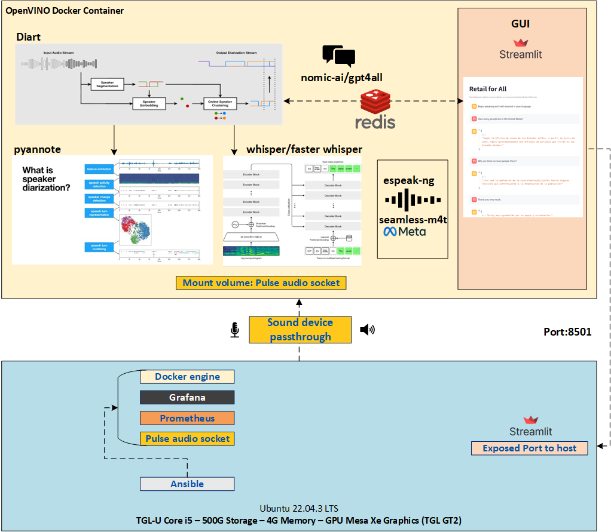
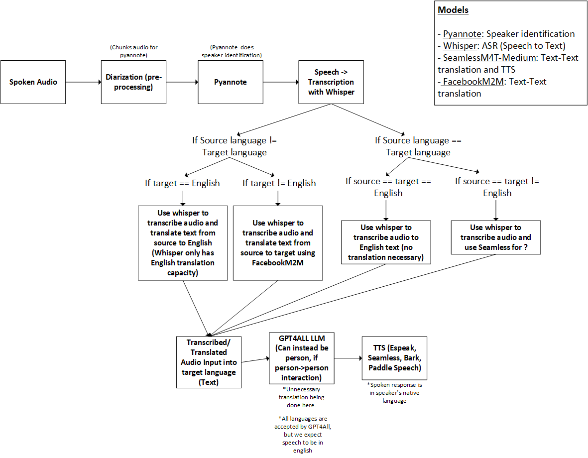

# Architecture

Terms
* **ASR** - Automated Speech Recognition (Identification of spoken language in audio input)
* **SST** - Speech to Text (the model takes speech as input and provides a text transcription)
* **SID** - Speaker Identification (the model takes audio and identifies unique speakers)
* **TTS** - Text to Speech (the model takes text as input and generates speech)
* **TTT** - Text to text (the model takes text as input and ouputs text)
* **TRN** - Translation (the model can translate between one-to-many or many-to-many languages)

## Supported ASR Models

| **Model Name** | **Function** | **Language Support**|
|----------------|----------|------------|
|[M2M100](https://huggingface.co/docs/transformers/en/model_doc/m2m_100)| TTT, TRN |Multilingual (Any to Any)|
|[seamless-m4t](https://huggingface.co/docs/transformers/main/en/model_doc/seamless_m4t)|STT, TTT, TRN, TTS| Multilingual (Any to Any)|
|[fairseq](https://github.com/facebookresearch/fairseq/tree/main/examples/mms)|TTS|Single Language|
|[bark](https://huggingface.co/suno/bark)|TTS|Multilingual|
|[whisper](https://huggingface.co/suno/bark)|SST,TRN|Multilingual (Any to English)|

## Conversational AI

The chat capability is provided by [GPT4All](https://www.nomic.ai/gpt4all), selected because it is edge-optimized and inference is done on-device.
The model in use is [orca-mini-3b-gguf2-q4_0.gguf](https://raw.githubusercontent.com/nomic-ai/gpt4all/main/gpt4all-chat/metadata/models3.json)

## High Level

## Pipeline Deep Dive

## Projects / Technologies Used

* [GPT4All](https://docs.gpt4all.io/gpt4all_python.html#influencing-generation)
* [Diart](https://github.com/juanmc2005/diart)
* [pulseaudio in container](https://askubuntu.com/questions/1123375/create-pulseaudio-socket-at-system-startup-in-ubuntu-16-04)
* [systemctl pulse audio](https://askubuntu.com/questions/1197420/how-do-i-stop-pulseaudio)
* [system wide pulse audio](https://gist.github.com/kafene/32a07cac0373409e31f5bfe981eefb19)
* [Using Pulse Audio in a Container](https://github.com/mviereck/x11docker/wiki/Container-sound:-ALSA-or-Pulseaudio)
* [espeak-ng - lightweight text to speech](https://github.com/sayak-brm/espeakng-python)
* [streamlit UI](https://streamlit.io/)
* [redis pub/sub](https://redis.io/docs/latest/develop/interact/pubsub/)
* [Coqui TTS](https://github.com/coqui-ai/TTS)

[[Back to main page](../../README.md)]
