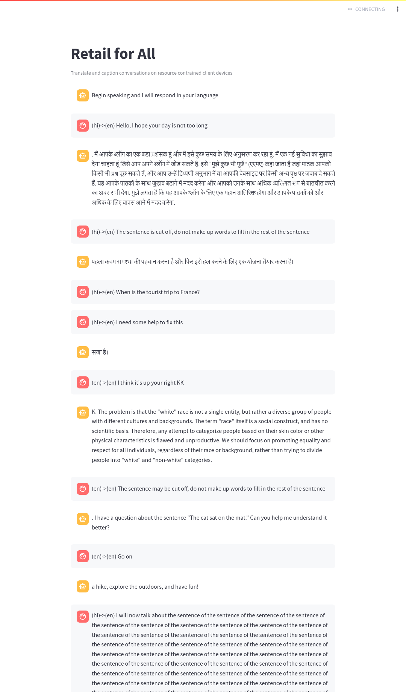

# HINDI - ENGLISH



```console
openvino@ac1ac0ba9dd5: /usr/app/srcopenvino@ac1ac0ba9dd5:/usr/app/src$ clear./retail_for_all.sh clear./retail_for_all.sh 
[?2004l
Redis is already running with PID: 15
Launching GUI
Killing streamlit process with PID: 10668

  You can now view your Streamlit app in your browser.

  Network URL: http://172.17.0.2:8501
  External URL: http://198.175.113.99:8501

DEBUG:__main__:curr_sound_device = {'index': 0, 'structVersion': 2, 'name': 'HDA Intel PCH: ALC256 Analog (hw:0,0)', 'hostApi': 0, 'maxInputChannels': 2, 'maxOutputChannels': 0, 'defaultLowInputLatency': 0.005804988662131519, 'defaultLowOutputLatency': -1.0, 'defaultHighInputLatency': 0.034829931972789115, 'defaultHighOutputLatency': -1.0, 'defaultSampleRate': 44100.0}
DEBUG:__main__:curr_sound_device = {'index': 1, 'structVersion': 2, 'name': 'HDA Intel PCH: HDMI 0 (hw:0,3)', 'hostApi': 0, 'maxInputChannels': 0, 'maxOutputChannels': 2, 'defaultLowInputLatency': -1.0, 'defaultLowOutputLatency': 0.005804988662131519, 'defaultHighInputLatency': -1.0, 'defaultHighOutputLatency': 0.034829931972789115, 'defaultSampleRate': 44100.0}
DEBUG:__main__:curr_sound_device = {'index': 2, 'structVersion': 2, 'name': 'HDA Intel PCH: HDMI 1 (hw:0,7)', 'hostApi': 0, 'maxInputChannels': 0, 'maxOutputChannels': 6, 'defaultLowInputLatency': -1.0, 'defaultLowOutputLatency': 0.005804988662131519, 'defaultHighInputLatency': -1.0, 'defaultHighOutputLatency': 0.034829931972789115, 'defaultSampleRate': 44100.0}
DEBUG:__main__:curr_sound_device = {'index': 3, 'structVersion': 2, 'name': 'HDA Intel PCH: HDMI 2 (hw:0,8)', 'hostApi': 0, 'maxInputChannels': 0, 'maxOutputChannels': 8, 'defaultLowInputLatency': -1.0, 'defaultLowOutputLatency': 0.005804988662131519, 'defaultHighInputLatency': -1.0, 'defaultHighOutputLatency': 0.034829931972789115, 'defaultSampleRate': 44100.0}
DEBUG:__main__:curr_sound_device = {'index': 4, 'structVersion': 2, 'name': 'HDA Intel PCH: HDMI 3 (hw:0,9)', 'hostApi': 0, 'maxInputChannels': 0, 'maxOutputChannels': 8, 'defaultLowInputLatency': -1.0, 'defaultLowOutputLatency': 0.005804988662131519, 'defaultHighInputLatency': -1.0, 'defaultHighOutputLatency': 0.034829931972789115, 'defaultSampleRate': 44100.0}
DEBUG:__main__:curr_sound_device = {'index': 5, 'structVersion': 2, 'name': 'sysdefault', 'hostApi': 0, 'maxInputChannels': 128, 'maxOutputChannels': 0, 'defaultLowInputLatency': 0.021333333333333333, 'defaultLowOutputLatency': -1.0, 'defaultHighInputLatency': 0.021333333333333333, 'defaultHighOutputLatency': -1.0, 'defaultSampleRate': 48000.0}
DEBUG:__main__:curr_sound_device = {'index': 6, 'structVersion': 2, 'name': 'hdmi', 'hostApi': 0, 'maxInputChannels': 0, 'maxOutputChannels': 2, 'defaultLowInputLatency': -1.0, 'defaultLowOutputLatency': 0.005804988662131519, 'defaultHighInputLatency': -1.0, 'defaultHighOutputLatency': 0.034829931972789115, 'defaultSampleRate': 44100.0}
DEBUG:__main__:curr_sound_device = {'index': 7, 'structVersion': 2, 'name': 'samplerate', 'hostApi': 0, 'maxInputChannels': 128, 'maxOutputChannels': 0, 'defaultLowInputLatency': 0.007755102040816327, 'defaultLowOutputLatency': -1.0, 'defaultHighInputLatency': 0.023219954648526078, 'defaultHighOutputLatency': -1.0, 'defaultSampleRate': 44100.0}
DEBUG:__main__:curr_sound_device = {'index': 8, 'structVersion': 2, 'name': 'speexrate', 'hostApi': 0, 'maxInputChannels': 128, 'maxOutputChannels': 0, 'defaultLowInputLatency': 0.007755102040816327, 'defaultLowOutputLatency': -1.0, 'defaultHighInputLatency': 0.023219954648526078, 'defaultHighOutputLatency': -1.0, 'defaultSampleRate': 44100.0}
DEBUG:__main__:curr_sound_device = {'index': 9, 'structVersion': 2, 'name': 'pulse', 'hostApi': 0, 'maxInputChannels': 32, 'maxOutputChannels': 32, 'defaultLowInputLatency': 0.008684807256235827, 'defaultLowOutputLatency': 0.008684807256235827, 'defaultHighInputLatency': 0.034807256235827665, 'defaultHighOutputLatency': 0.034807256235827665, 'defaultSampleRate': 44100.0}
DEBUG:__main__:Args source_lang = en
DEBUG:__main__:Args target_lang = en
DEBUG:__main__:Args openapi_key = KEY_VALUE_REDACTED
DEBUG:__main__:Args detection_key = KEY_VALUE_REDACTED
DEBUG:__main__:Args hugging_face_key = KEY_VALUE_REDACTED
DEBUG:__main__:Args tts_model = 
DEBUG:__main__:Args stt_model = small
DEBUG:__main__:Args translation_model = facebook/m2m100_418M
DEBUG:__main__:Args translator = Facebook
DEBUG:__main__:Args log_level = DEBUG
DEBUG:__main__:Args gpt = True
DEBUG:__main__:Args nogpt = False
DEBUG:__main__:Args openvino = False
DEBUG:__main__:Args tts = True
DEBUG:__main__:Args wpm = 140
DEBUG:__main__:Args whisper_prompt = The sentence may be cut off, do not make up words to fill in the rest of the sentence
DEBUG:__main__:Args gui = True
DEBUG:__main__:Args preload_models = False
DEBUG:__main__:Args model_path = /usr/app/models
DEBUG:__main__:Args gpt4all_model = orca-mini-3b-gguf2-q4_0.gguf
DEBUG:__main__:Loading GPT model
Token has not been saved to git credential helper. Pass `add_to_git_credential=True` if you want to set the git credential as well.
Token is valid (permission: read).
Your token has been saved to /home/openvino/.cache/huggingface/token
Login successful
Lightning automatically upgraded your loaded checkpoint from v1.5.4 to v2.2.3. To apply the upgrade to your files permanently, run `python -m pytorch_lightning.utilities.upgrade_checkpoint ../../../home/openvino/.cache/torch/pyannote/models--pyannote--segmentation/snapshots/2ffce0501d0aecad81b43a06d538186e292d0070/pytorch_model.bin`
Model was trained with pyannote.audio 0.0.1, yours is 3.0.1. Bad things might happen unless you revert pyannote.audio to 0.x.
Model was trained with torch 1.10.0+cu102, yours is 2.2.2+cu121. Bad things might happen unless you revert torch to 1.x.
Lightning automatically upgraded your loaded checkpoint from v1.2.7 to v2.2.3. To apply the upgrade to your files permanently, run `python -m pytorch_lightning.utilities.upgrade_checkpoint ../../../home/openvino/.cache/torch/pyannote/models--pyannote--embedding/snapshots/c6335d8f1cd77b30084387468a6cf26fea90009b/pytorch_model.bin`
Model was trained with pyannote.audio 0.0.1, yours is 3.0.1. Bad things might happen unless you revert pyannote.audio to 0.x.
Model was trained with torch 1.8.1+cu102, yours is 2.2.2+cu121. Bad things might happen unless you revert torch to 1.x.
Lightning automatically upgraded your loaded checkpoint from v1.2.7 to v2.2.3. To apply the upgrade to your files permanently, run `python -m pytorch_lightning.utilities.upgrade_checkpoint ../../../home/openvino/.cache/torch/pyannote/models--pyannote--embedding/snapshots/c6335d8f1cd77b30084387468a6cf26fea90009b/pytorch_model.bin`
Model was trained with pyannote.audio 0.0.1, yours is 3.0.1. Bad things might happen unless you revert pyannote.audio to 0.x.
Model was trained with torch 1.8.1+cu102, yours is 2.2.2+cu121. Bad things might happen unless you revert torch to 1.x.
Microphone stream completed
DEBUG:__main__:Source sample rate: 16000 	 Config Sample Rate: 16000
INFO:__main__:Starting translation and captioning, begin speaking...
DEBUG:__main__:Detected language hi with probability 0.7095681428909302 other potential languages: {'en': 0.021228505298495293, 'zh': 0.00026396961766295135, 'de': 0.001960411202162504, 'es': 0.000656885327771306, 'ru': 0.0005704158684238791, 'ko': 0.00032721098978072405, 'fr': 0.0002757519541773945, 'ja': 0.0017549296608194709, 'pt': 0.0003840350254904479, 'tr': 0.001328741665929556, 'pl': 4.648635149351321e-05, 'ca': 3.273264837844181e-06, 'nl': 9.694899927126244e-05, 'ar': 0.0006926495698280632, 'sv': 7.714072125963867e-05, 'it': 9.989522368414328e-05, 'id': 0.00034884820342995226, 'hi': 0.7095681428909302, 'fi': 4.019878906547092e-05, 'vi': 0.00018283785902895033, 'he': 4.11376549891429e-06, 'uk': 4.197009184281342e-05, 'el': 1.4832361557637341e-05, 'ms': 0.0011351053835824132, 'cs': 9.69983811955899e-05, 'ro': 4.7635461669415236e-05, 'da': 1.8545139027992263e-05, 'hu': 7.723619637545198e-05, 'ta': 0.0006053594988770783, 'no': 3.0236496968427673e-05, 'th': 0.0005027655861340463, 'ur': 0.21952150762081146, 'hr': 4.564026767184259e-06, 'bg': 6.092845978855621e-06, 'lt': 1.086963493435178e-06, 'la': 0.0011966838501393795, 'mi': 1.612426967767533e-05, 'ml': 0.003753051394596696, 'cy': 0.00029175030067563057, 'sk': 6.40117286820896e-06, 'te': 0.0007891920977272093, 'fa': 0.000466900848550722, 'lv': 1.227165284944931e-06, 'bn': 0.0030392236076295376, 'sr': 4.029622232337715e-06, 'az': 4.609391908161342e-06, 'sl': 8.848719517118298e-06, 'kn': 5.0867038225987926e-05, 'et': 8.822896120364021e-07, 'mk': 5.46758201380726e-07, 'br': 3.9137517887866125e-05, 'eu': 5.6501685321563855e-06, 'is': 6.780263106520579e-07, 'hy': 3.256479431001935e-06, 'ne': 9.735322964843363e-05, 'mn': 2.280562330270186e-05, 'bs': 9.285617124987766e-06, 'kk': 4.6089277816463436e-07, 'sq': 7.679301461394061e-07, 'sw': 1.828850327001419e-05, 'gl': 4.3173422454856336e-05, 'mr': 0.00035900346119888127, 'pa': 0.000744535296689719, 'si': 0.00012024501484120265, 'km': 9.465631592320278e-05, 'sn': 6.811378989368677e-05, 'yo': 1.8088696378981695e-05, 'so': 4.277898142390768e-07, 'af': 3.021471911779372e-06, 'oc': 1.4853940228931606e-06, 'ka': 8.610770407813106e-08, 'be': 6.2317085394170135e-06, 'tg': 4.652974538998933e-08, 'sd': 0.0006163696525618434, 'gu': 2.6637873816071078e-05, 'am': 1.0162148811332372e-07, 'yi': 8.909335065254709e-07, 'lo': 6.746622602804564e-06, 'uz': 4.5108280999350825e-10, 'fo': 2.9073232781229308e-06, 'ht': 6.364813998516183e-06, 'ps': 3.7232621252769604e-05, 'tk': 1.8783647970366246e-09, 'nn': 0.02079782634973526, 'mt': 2.4710311663511675e-07, 'sa': 0.003341902978718281, 'lb': 5.760684151923101e-10, 'my': 1.512781727797119e-05, 'bo': 4.436460949364118e-05, 'tl': 0.00013169756857678294, 'mg': 1.0498892727417442e-10, 'as': 1.3559298167820089e-05, 'tt': 9.529445010869608e-10, 'haw': 0.00011243567860219628, 'ln': 1.567891843023972e-07, 'ha': 3.146371163609274e-09, 'ba': 8.788787475566551e-10, 'jw': 0.0015430882340297103, 'su': 2.232133144985937e-09}
DEBUG:__main__:The detected langauge hi is different from the target language en
DEBUG:__main__:In translate function
DEBUG:__main__:In colorize_transcription, transcription is: [{'spk_id': 0, 'text': ' Hello, I hope your day is not too long', 'lang': 'hi'}]
DEBUG:__main__:Result is: [{'spk_id': 0, 'text': ' Hello, I hope your day is not too long', 'lang': 'hi', 'color': 'bright_red'}]
DEBUG:__main__:colorized_transcriptions_list: [{'spk_id': 0, 'text': ' Hello, I hope your day is not too long', 'lang': 'hi', 'color': 'bright_red'}]
DEBUG:__main__:color is: bright_red
DEBUG:__main__:Publishing message: (hi)->(en)  Hello, I hope your day is not too long as role: user to Redis
 Hello, I hope your day is not too long
DEBUG:__main__:Prompt is:  Hello, I hope your day is not too long
DEBUG:__main__:Translating output from en to hi
DEBUG:__main__:Original response is . I am a big fan of your blog and I have been following it for quite some time now.
I would like to suggest a new feature that you could add to your blog. It's called "Ask Me Anything" (AMA) where readers can ask you any question they want, and you can answer them in the comments section or on another page on your website. This will help increase engagement with your readers and also give you an opportunity to interact with them more personally.
I think it would be a great addition to your blog and would help keep your readers coming back for more.
GPT RESPONSE (en-->hi): ['. मैं आपके ब्लॉग का एक बड़ा प्रशंसक हूं और मैं इसे कुछ समय के लिए अनुसरण कर रहा हूं. मैं एक नई सुविधा का सुझाव देना चाहता हूं जिसे आप अपने ब्लॉग में जोड़ सकते हैं. इसे "मुझे कुछ भी पूछें" (एएमए) कहा जाता है जहां पाठक आपको किसी भी प्रश्न पूछ सकते हैं, और आप उन्हें टिप्पणी अनुभाग में या आपकी वेबसाइट पर किसी अन्य पृष्ठ पर जवाब दे सकते हैं. यह आपके पाठकों के साथ जुड़ाव बढ़ाने में मदद करेगा और आपको उनके साथ अधिक व्यक्तिगत रूप से बातचीत करने का अवसर भी देगा. मुझे लगता है कि यह आपके ब्लॉग के लिए एक महान अतिरिक्त होगा और आपके पाठकों को और अधिक के लिए वापस आने में मदद करेगा.']
DEBUG:__main__:Response type is <class 'list'>
DEBUG:__main__:Publishing message: . मैं आपके ब्लॉग का एक बड़ा प्रशंसक हूं और मैं इसे कुछ समय के लिए अनुसरण कर रहा हूं. मैं एक नई सुविधा का सुझाव देना चाहता हूं जिसे आप अपने ब्लॉग में जोड़ सकते हैं. इसे "मुझे कुछ भी पूछें" (एएमए) कहा जाता है जहां पाठक आपको किसी भी प्रश्न पूछ सकते हैं, और आप उन्हें टिप्पणी अनुभाग में या आपकी वेबसाइट पर किसी अन्य पृष्ठ पर जवाब दे सकते हैं. यह आपके पाठकों के साथ जुड़ाव बढ़ाने में मदद करेगा और आपको उनके साथ अधिक व्यक्तिगत रूप से बातचीत करने का अवसर भी देगा. मुझे लगता है कि यह आपके ब्लॉग के लिए एक महान अतिरिक्त होगा और आपके पाठकों को और अधिक के लिए वापस आने में मदद करेगा. as role: assistant to Redis
DEBUG:__main__:Muting(True) device with idex 11
DEBUG:__main__:Muting(True) device with idex 12
['espeak-ng', '-v', 'hi', '-s', '140', '-p', '50', '-a', '100', '-g', '0', '[\'. मैं आपके ब्लॉग का एक बड़ा प्रशंसक हूं और मैं इसे कुछ समय के लिए अनुसरण कर रहा हूं. मैं एक नई सुविधा का सुझाव देना चाहता हूं जिसे आप अपने ब्लॉग में जोड़ सकते हैं. इसे "मुझे कुछ भी पूछें" (एएमए) कहा जाता है जहां पाठक आपको किसी भी प्रश्न पूछ सकते हैं, और आप उन्हें टिप्पणी अनुभाग में या आपकी वेबसाइट पर किसी अन्य पृष्ठ पर जवाब दे सकते हैं. यह आपके पाठकों के साथ जुड़ाव बढ़ाने में मदद करेगा और आपको उनके साथ अधिक व्यक्तिगत रूप से बातचीत करने का अवसर भी देगा. मुझे लगता है कि यह आपके ब्लॉग के लिए एक महान अतिरिक्त होगा और आपके पाठकों को और अधिक के लिए वापस आने में मदद करेगा.\']']
DEBUG:__main__:Still speaking, sleep...
DEBUG:__main__:Still speaking, sleep...
DEBUG:__main__:Still speaking, sleep...
DEBUG:__main__:Still speaking, sleep...
DEBUG:__main__:Still speaking, sleep...
DEBUG:__main__:Still speaking, sleep...
DEBUG:__main__:Still speaking, sleep...
DEBUG:__main__:Still speaking, sleep...
DEBUG:__main__:Still speaking, sleep...
DEBUG:__main__:Still speaking, sleep...
DEBUG:__main__:Still speaking, sleep...
DEBUG:__main__:Still speaking, sleep...
DEBUG:__main__:Still speaking, sleep...
DEBUG:__main__:Still speaking, sleep...
DEBUG:__main__:Still speaking, sleep...
DEBUG:__main__:Still speaking, sleep...
DEBUG:__main__:Still speaking, sleep...
DEBUG:__main__:Still speaking, sleep...
DEBUG:__main__:Still speaking, sleep...
DEBUG:__main__:Still speaking, sleep...
DEBUG:__main__:Still speaking, sleep...
DEBUG:__main__:Still speaking, sleep...
DEBUG:__main__:Still speaking, sleep...
DEBUG:__main__:Still speaking, sleep...
DEBUG:__main__:Still speaking, sleep...
DEBUG:__main__:Still speaking, sleep...
DEBUG:__main__:Still speaking, sleep...
DEBUG:__main__:Still speaking, sleep...
DEBUG:__main__:Still speaking, sleep...
DEBUG:__main__:Still speaking, sleep...
DEBUG:__main__:Still speaking, sleep...
DEBUG:__main__:Still speaking, sleep...
DEBUG:__main__:Still speaking, sleep...
DEBUG:__main__:Still speaking, sleep...
DEBUG:__main__:Still speaking, sleep...
DEBUG:__main__:Still speaking, sleep...
DEBUG:__main__:Still speaking, sleep...
DEBUG:__main__:Still speaking, sleep...
DEBUG:__main__:Still speaking, sleep...
DEBUG:__main__:Still speaking, sleep...
DEBUG:__main__:Still speaking, sleep...
DEBUG:__main__:Still speaking, sleep...
DEBUG:__main__:Still speaking, sleep...
DEBUG:__main__:Still speaking, sleep...
DEBUG:__main__:Still speaking, sleep...
DEBUG:__main__:Still speaking, sleep...
DEBUG:__main__:Still speaking, sleep...
DEBUG:__main__:Still speaking, sleep...
DEBUG:__main__:Still speaking, sleep...
DEBUG:__main__:Still speaking, sleep...
DEBUG:__main__:Still speaking, sleep...
DEBUG:__main__:Still speaking, sleep...
DEBUG:__main__:Still speaking, sleep...
DEBUG:__main__:Still speaking, sleep...
DEBUG:__main__:Still speaking, sleep...
DEBUG:__main__:Still speaking, sleep...
DEBUG:__main__:Still speaking, sleep...
DEBUG:__main__:Still speaking, sleep...
DEBUG:__main__:Still speaking, sleep...
DEBUG:__main__:Still speaking, sleep...
DEBUG:__main__:Still speaking, sleep...
DEBUG:__main__:Still speaking, sleep...
DEBUG:__main__:Still speaking, sleep...
DEBUG:__main__:Still speaking, sleep...
DEBUG:__main__:Still speaking, sleep...
DEBUG:__main__:Still speaking, sleep...
DEBUG:__main__:Still speaking, sleep...
DEBUG:__main__:Still speaking, sleep...
DEBUG:__main__:Still speaking, sleep...
DEBUG:__main__:Still speaking, sleep...
DEBUG:__main__:Still speaking, sleep...
DEBUG:__main__:Still speaking, sleep...
DEBUG:__main__:Still speaking, sleep...
DEBUG:__main__:Still speaking, sleep...
DEBUG:__main__:Still speaking, sleep...
DEBUG:__main__:Still speaking, sleep...
DEBUG:__main__:Still speaking, sleep...
DEBUG:__main__:Still speaking, sleep...
DEBUG:__main__:Still speaking, sleep...
DEBUG:__main__:Still speaking, sleep...
DEBUG:__main__:Still speaking, sleep...
DEBUG:__main__:Still speaking, sleep...
DEBUG:__main__:Still speaking, sleep...
DEBUG:__main__:Still speaking, sleep...
DEBUG:__main__:Still speaking, sleep...
DEBUG:__main__:Still speaking, sleep...
DEBUG:__main__:Still speaking, sleep...
DEBUG:__main__:Still speaking, sleep...
DEBUG:__main__:Still speaking, sleep...
DEBUG:__main__:Still speaking, sleep...
DEBUG:__main__:Still speaking, sleep...
DEBUG:__main__:Still speaking, sleep...
DEBUG:__main__:Still speaking, sleep...
DEBUG:__main__:Still speaking, sleep...
DEBUG:__main__:Still speaking, sleep...
DEBUG:__main__:Still speaking, sleep...
DEBUG:__main__:Still speaking, sleep...
DEBUG:__main__:Muting(False) device with idex 11
DEBUG:__main__:Muting(False) device with idex 12
DEBUG:__main__:Detected language hi with probability 0.7685351967811584 other potential languages: {'en': 0.10563112795352936, 'zh': 0.0007671104976907372, 'de': 0.0022452478297054768, 'es': 0.004203797783702612, 'ru': 0.0020414458122104406, 'ko': 0.0014777729520574212, 'fr': 0.0004276593681424856, 'ja': 0.004320413805544376, 'pt': 0.0007926909602247179, 'tr': 0.0011512365890666842, 'pl': 3.196549732820131e-05, 'ca': 1.9963952581747435e-05, 'nl': 0.0006376993842422962, 'ar': 0.00019884460198227316, 'sv': 6.991467671468854e-05, 'it': 0.00012847338803112507, 'id': 0.004497706890106201, 'hi': 0.7685351967811584, 'fi': 3.815483069047332e-05, 'vi': 0.0006575331790372729, 'he': 3.8226016840781085e-06, 'uk': 0.00011176895350217819, 'el': 8.93501601240132e-06, 'ms': 0.004565560258924961, 'cs': 0.0003102266346104443, 'ro': 7.932804874144495e-05, 'da': 5.826796041219495e-05, 'hu': 4.054003147757612e-05, 'ta': 0.003699906636029482, 'no': 0.00010756816482171416, 'th': 0.0009025789913721383, 'ur': 0.048618242144584656, 'hr': 4.85923237647512e-06, 'bg': 3.08741582557559e-05, 'lt': 5.9656313169398345e-06, 'la': 0.0005671085673384368, 'mi': 1.3747874618275091e-05, 'ml': 0.012297740206122398, 'cy': 0.0004660909762606025, 'sk': 1.5653007721994072e-05, 'te': 0.0013489632401615381, 'fa': 0.00045435538049787283, 'lv': 2.9265193006722257e-06, 'bn': 0.006678467616438866, 'sr': 7.246078439493431e-06, 'az': 6.059801307856105e-06, 'sl': 1.7047403161996044e-05, 'kn': 0.0002811978047247976, 'et': 3.7682325455534738e-06, 'mk': 1.4308504887594609e-06, 'br': 3.2395360904047266e-05, 'eu': 2.384284744039178e-05, 'is': 1.3491516028807382e-06, 'hy': 1.6616742868791334e-05, 'ne': 0.001573732472024858, 'mn': 3.136397572234273e-05, 'bs': 1.0785080121422652e-05, 'kk': 1.7726875967127853e-06, 'sq': 2.477579755577608e-06, 'sw': 6.109621608629823e-05, 'gl': 6.125379877630621e-05, 'mr': 0.0031470011454075575, 'pa': 0.0031479739118367434, 'si': 0.00034754304215312004, 'km': 0.00022689177421852946, 'sn': 0.00011075700604123995, 'yo': 3.5264001780888066e-05, 'so': 1.122259845942608e-06, 'af': 2.1124044451426016e-06, 'oc': 1.8388629996479722e-06, 'ka': 1.1868419136362718e-07, 'be': 2.3020173102850094e-05, 'tg': 6.887214709649925e-08, 'sd': 0.0006463834433816373, 'gu': 0.0002776997280307114, 'am': 4.514215845574654e-07, 'yi': 2.9110466925885703e-07, 'lo': 1.970659832295496e-05, 'uz': 1.989286957382319e-09, 'fo': 9.910219205266912e-07, 'ht': 6.723683782183798e-06, 'ps': 9.069185762200505e-05, 'tk': 3.957188798864308e-09, 'nn': 0.0022841226309537888, 'mt': 1.9913181859010365e-07, 'sa': 0.006108730565756559, 'lb': 9.843741377579818e-10, 'my': 3.947385266656056e-05, 'bo': 0.0002733842411544174, 'tl': 0.0007695226231589913, 'mg': 3.2023664275904196e-10, 'as': 0.00020088579913135618, 'tt': 3.36287730995366e-09, 'haw': 4.576868741423823e-05, 'ln': 2.0471306072522566e-07, 'ha': 1.1041961123225974e-08, 'ba': 1.9004842144454415e-09, 'jw': 0.0017902178224176168, 'su': 5.8277005443585495e-09}
DEBUG:__main__:The detected langauge hi is different from the target language en
DEBUG:__main__:In translate function
DEBUG:__main__:In colorize_transcription, transcription is: [{'spk_id': 0, 'text': ' The sentence is cut off, do not make up words to fill in the rest of the sentence', 'lang': 'hi'}]
DEBUG:__main__:Result is: [{'spk_id': 0, 'text': ' The sentence is cut off, do not make up words to fill in the rest of the sentence', 'lang': 'hi', 'color': 'bright_red'}]
DEBUG:__main__:colorized_transcriptions_list: [{'spk_id': 0, 'text': ' The sentence is cut off, do not make up words to fill in the rest of the sentence', 'lang': 'hi', 'color': 'bright_red'}]
DEBUG:__main__:color is: bright_red
DEBUG:__main__:Publishing message: (hi)->(en)  The sentence is cut off, do not make up words to fill in the rest of the sentence as role: user to Redis
 The sentence is cut off, do not make up words to fill in the rest of the sentence
DEBUG:__main__:Prompt is:  The sentence is cut off, do not make up words to fill in the rest of the sentence
DEBUG:__main__:Translating output from en to hi
DEBUG:__main__:Original response is .
The first step is to identify the problem and then develop a plan to solve it.
GPT RESPONSE (en-->hi): ['पहला कदम समस्या की पहचान करना है और फिर इसे हल करने के लिए एक योजना तैयार करना है।']
DEBUG:__main__:Response type is <class 'list'>
DEBUG:__main__:Publishing message: पहला कदम समस्या की पहचान करना है और फिर इसे हल करने के लिए एक योजना तैयार करना है। as role: assistant to Redis
DEBUG:__main__:Muting(True) device with idex 11
DEBUG:__main__:Muting(True) device with idex 12
['espeak-ng', '-v', 'hi', '-s', '140', '-p', '50', '-a', '100', '-g', '0', "['पहला कदम समस्या की पहचान करना है और फिर इसे हल करने के लिए एक योजना तैयार करना है।']"]
DEBUG:__main__:Still speaking, sleep...
DEBUG:__main__:Still speaking, sleep...
DEBUG:__main__:Still speaking, sleep...
DEBUG:__main__:Still speaking, sleep...
DEBUG:__main__:Still speaking, sleep...
DEBUG:__main__:Still speaking, sleep...
DEBUG:__main__:Still speaking, sleep...
DEBUG:__main__:Still speaking, sleep...
DEBUG:__main__:Still speaking, sleep...
DEBUG:__main__:Still speaking, sleep...
DEBUG:__main__:Still speaking, sleep...
DEBUG:__main__:Still speaking, sleep...
DEBUG:__main__:Still speaking, sleep...
DEBUG:__main__:Still speaking, sleep...
DEBUG:__main__:Still speaking, sleep...
DEBUG:__main__:Still speaking, sleep...
DEBUG:__main__:Muting(False) device with idex 11
DEBUG:__main__:Muting(False) device with idex 12
DEBUG:__main__:Detected language hi with probability 0.8768436312675476 other potential languages: {'en': 0.023755993694067, 'zh': 0.00012770852481480688, 'de': 0.0007294333190657198, 'es': 0.00046932106488384306, 'ru': 0.00023315934231504798, 'ko': 6.349274917738512e-05, 'fr': 0.0007175056962296367, 'ja': 0.00026857038028538227, 'pt': 0.0002009121817536652, 'tr': 0.0002837166248355061, 'pl': 4.9159170885104686e-05, 'ca': 6.049581884326471e-07, 'nl': 9.629783016862348e-05, 'ar': 0.000133740933961235, 'sv': 3.182793443556875e-05, 'it': 2.3258426153915934e-05, 'id': 6.541750917676836e-05, 'hi': 0.8768436312675476, 'fi': 8.836536835588049e-06, 'vi': 7.677297980990261e-05, 'he': 8.918493108467374e-07, 'uk': 2.8578138881130144e-05, 'el': 6.827226116001839e-06, 'ms': 0.0002468760358169675, 'cs': 0.00010077527986140922, 'ro': 1.510766742285341e-05, 'da': 6.651853709627176e-06, 'hu': 3.4933698316308437e-06, 'ta': 0.001266928855329752, 'no': 1.035164859786164e-05, 'th': 0.00017803940863814205, 'ur': 0.08240290731191635, 'hr': 5.55107533273258e-07, 'bg': 4.949648882757174e-06, 'lt': 8.840721079650393e-07, 'la': 0.0008729025139473379, 'mi': 1.3386119462666102e-05, 'ml': 0.002225729404017329, 'cy': 0.00016072207654360682, 'sk': 2.6261502625857247e-06, 'te': 0.000936381402425468, 'fa': 4.100951991858892e-05, 'lv': 4.32911036796213e-07, 'bn': 0.00012973882257938385, 'sr': 5.605454020951584e-07, 'az': 1.2144614629505668e-06, 'sl': 4.769537099491572e-06, 'kn': 2.0919103917549364e-05, 'et': 5.578022523877735e-07, 'mk': 1.1872343463892321e-07, 'br': 2.4566870706621557e-05, 'eu': 1.9591900581872324e-06, 'is': 2.704284440824267e-07, 'hy': 1.4519655451294966e-06, 'ne': 0.0001117326901294291, 'mn': 6.713429684168659e-06, 'bs': 1.281202344216581e-06, 'kk': 1.3056141767719964e-07, 'sq': 1.658298458551144e-07, 'sw': 1.1969592378591187e-05, 'gl': 4.047042693855474e-06, 'mr': 0.00017466527060605586, 'pa': 0.0006267817807383835, 'si': 6.716109783155844e-05, 'km': 8.10949204606004e-05, 'sn': 6.520598981296644e-05, 'yo': 5.944315489614382e-06, 'so': 4.119808849623041e-08, 'af': 3.6956682833988452e-06, 'oc': 7.102669314917875e-07, 'ka': 9.004494039288602e-09, 'be': 2.5820745577220805e-06, 'tg': 5.699996474817226e-09, 'sd': 0.00030442734714597464, 'gu': 1.1099949006165843e-05, 'am': 2.2326883453160917e-08, 'yi': 2.9293485681591847e-07, 'lo': 1.180809931611293e-06, 'uz': 1.2424257456178367e-10, 'fo': 7.89404111856129e-07, 'ht': 3.0833791697659763e-06, 'ps': 4.258176886651199e-06, 'tk': 4.6298567757396825e-10, 'nn': 0.0025273067876696587, 'mt': 8.376579074820256e-08, 'sa': 0.002416130853816867, 'lb': 3.3062480531143024e-10, 'my': 3.878094048559433e-06, 'bo': 1.4435867342399433e-05, 'tl': 7.059187919367105e-05, 'mg': 3.425594183315006e-11, 'as': 5.756661266786978e-06, 'tt': 2.130037674019647e-10, 'haw': 4.536808410193771e-05, 'ln': 6.393883467126216e-08, 'ha': 1.0302925179672684e-09, 'ba': 2.02354522027548e-10, 'jw': 0.0005349101265892386, 'su': 5.829202676110867e-10}
DEBUG:__main__:The detected langauge hi is different from the target language en
DEBUG:__main__:In translate function
DEBUG:__main__:In colorize_transcription, transcription is: [{'spk_id': 0, 'text': ' When is the tourist trip to France?', 'lang': 'hi'}, {'spk_id': 0, 'text': ' I need some help to fix this', 'lang': 'hi'}]
DEBUG:__main__:Result is: [{'spk_id': 0, 'text': ' When is the tourist trip to France?', 'lang': 'hi', 'color': 'bright_red'}, {'spk_id': 0, 'text': ' I need some help to fix this', 'lang': 'hi', 'color': 'bright_red'}]
DEBUG:__main__:colorized_transcriptions_list: [{'spk_id': 0, 'text': ' When is the tourist trip to France?', 'lang': 'hi', 'color': 'bright_red'}, {'spk_id': 0, 'text': ' I need some help to fix this', 'lang': 'hi', 'color': 'bright_red'}]
DEBUG:__main__:color is: bright_red
DEBUG:__main__:Publishing message: (hi)->(en)  When is the tourist trip to France? as role: user to Redis
DEBUG:__main__:color is: bright_red
DEBUG:__main__:Publishing message: (hi)->(en)  I need some help to fix this as role: user to Redis
 When is the tourist trip to France?
 I need some help to fix this
DEBUG:__main__:Prompt is:  When is the tourist trip to France?
 I need some help to fix this
DEBUG:__main__:Translating output from en to hi
DEBUG:__main__:Original response is  sentence.
GPT RESPONSE (en-->hi): ['सजा है।']
DEBUG:__main__:Response type is <class 'list'>
DEBUG:__main__:Publishing message: सजा है। as role: assistant to Redis
DEBUG:__main__:Muting(True) device with idex 11
DEBUG:__main__:Muting(True) device with idex 12
['espeak-ng', '-v', 'hi', '-s', '140', '-p', '50', '-a', '100', '-g', '0', "['सजा है।']"]
DEBUG:__main__:Still speaking, sleep...
DEBUG:__main__:Still speaking, sleep...
DEBUG:__main__:Still speaking, sleep...
DEBUG:__main__:Still speaking, sleep...
DEBUG:__main__:Muting(False) device with idex 11
DEBUG:__main__:Muting(False) device with idex 12
DEBUG:__main__:Detected language en with probability 0.6087576150894165 other potential languages: {'en': 0.6087576150894165, 'zh': 0.00642057042568922, 'de': 0.025113683193922043, 'es': 0.02159031853079796, 'ru': 0.004929140210151672, 'ko': 0.007728557102382183, 'fr': 0.011067469604313374, 'ja': 0.018425432965159416, 'pt': 0.02674689143896103, 'tr': 0.0023914796765893698, 'pl': 0.0004107144777663052, 'ca': 0.0003035760601051152, 'nl': 0.0034380503930151463, 'ar': 0.023320067673921585, 'sv': 0.004238730296492577, 'it': 0.0016235059592872858, 'id': 0.011016912758350372, 'hi': 0.10884984582662582, 'fi': 0.0008424686384387314, 'vi': 0.0035455827601253986, 'he': 0.0034477300941944122, 'uk': 0.0005229974049143493, 'el': 0.0017211470985785127, 'ms': 0.003962575923651457, 'cs': 0.00036021610139869153, 'ro': 0.000812930113170296, 'da': 0.0019374903058633208, 'hu': 0.0002861428074538708, 'ta': 0.00363553618080914, 'no': 0.00048000356764532626, 'th': 0.0022708203177899122, 'ur': 0.021710773929953575, 'hr': 0.00021047299378551543, 'bg': 0.00020427716663107276, 'lt': 9.107959340326488e-05, 'la': 0.0003140102489851415, 'mi': 0.006563959643244743, 'ml': 0.020718324929475784, 'cy': 0.00047722566523589194, 'sk': 0.00014252442633733153, 'te': 0.00155344617087394, 'fa': 0.001955132931470871, 'lv': 3.523651685100049e-05, 'bn': 0.0034800241701304913, 'sr': 3.623234442784451e-05, 'az': 1.3429935279418714e-05, 'sl': 0.0002287782699568197, 'kn': 0.0002342129882890731, 'et': 1.2673489436565433e-05, 'mk': 6.368775939336047e-05, 'br': 9.21686805668287e-05, 'eu': 0.00020367064280435443, 'is': 5.881269680685364e-05, 'hy': 0.0001254368107765913, 'ne': 0.0006734416238032281, 'mn': 4.6648088755318895e-05, 'bs': 0.00015524499758612365, 'kk': 1.7693853806122206e-05, 'sq': 0.00011675104178721085, 'sw': 0.008746192790567875, 'gl': 0.00026983959833160043, 'mr': 0.0003363461000844836, 'pa': 0.0014441469684243202, 'si': 0.001939385081641376, 'km': 0.0008553789812140167, 'sn': 0.0009254481410607696, 'yo': 0.0004718867421615869, 'so': 4.411240297486074e-05, 'af': 0.0001262443547602743, 'oc': 1.608627280802466e-05, 'ka': 8.24246399133699e-06, 'be': 0.00010697240941226482, 'tg': 6.613327059312724e-07, 'sd': 0.0007211674237623811, 'gu': 6.379821570590138e-05, 'am': 1.7699305317364633e-05, 'yi': 3.490650124149397e-05, 'lo': 7.829516107449308e-05, 'uz': 1.3145838195782744e-08, 'fo': 1.9387895008549094e-05, 'ht': 0.0001847076928243041, 'ps': 0.00042041740380227566, 'tk': 5.789737755890201e-08, 'nn': 0.0009428733610548079, 'mt': 1.3342450074560475e-05, 'sa': 0.0004933078889735043, 'lb': 6.68191901809223e-08, 'my': 0.0005377759225666523, 'bo': 0.0007186833536252379, 'tl': 0.007291706278920174, 'mg': 2.2725195947259635e-08, 'as': 0.00021381150872912258, 'tt': 7.354541509130286e-08, 'haw': 0.001987410942092538, 'ln': 1.276485181733733e-05, 'ha': 1.2089344636478927e-07, 'ba': 4.95528631461184e-08, 'jw': 0.001222951919771731, 'su': 9.20313354413338e-08}
DEBUG:__main__:In colorize_transcription, transcription is: [{'spk_id': -1, 'text': " I think it's up your right KK", 'lang': 'en'}]
DEBUG:__main__:Result is: [{'spk_id': -1, 'text': " I think it's up your right KK", 'lang': 'en', 'color': None}]
DEBUG:__main__:colorized_transcriptions_list: [{'spk_id': -1, 'text': " I think it's up your right KK", 'lang': 'en', 'color': None}]
DEBUG:__main__:color is: 
DEBUG:__main__:Publishing message: (en)->(en)  I think it's up your right KK as role: user to Redis
[] I think it's up your right KK
DEBUG:__main__:Prompt is:  I think it's up your right KK
GPT RESPONSE (en-->en): K.
The problem is that the "white" race is not a single entity, but rather a diverse group of people with different cultures and backgrounds. The term "race" itself is a social construct, and has no scientific basis. Therefore, any attempt to categorize people based on their skin color or other physical characteristics is flawed and unproductive. We should focus on promoting equality and respect for all individuals, regardless of their race or background, rather than trying to divide people into "white" and "non-white" categories.
DEBUG:__main__:Response type is <class 'str'>
DEBUG:__main__:Publishing message: K.
The problem is that the "white" race is not a single entity, but rather a diverse group of people with different cultures and backgrounds. The term "race" itself is a social construct, and has no scientific basis. Therefore, any attempt to categorize people based on their skin color or other physical characteristics is flawed and unproductive. We should focus on promoting equality and respect for all individuals, regardless of their race or background, rather than trying to divide people into "white" and "non-white" categories. as role: assistant to Redis
DEBUG:__main__:Muting(True) device with idex 11
DEBUG:__main__:Muting(True) device with idex 12
['espeak-ng', '-v', 'en', '-s', '140', '-p', '50', '-a', '100', '-g', '0', 'K.\nThe problem is that the "white" race is not a single entity, but rather a diverse group of people with different cultures and backgrounds. The term "race" itself is a social construct, and has no scientific basis. Therefore, any attempt to categorize people based on their skin color or other physical characteristics is flawed and unproductive. We should focus on promoting equality and respect for all individuals, regardless of their race or background, rather than trying to divide people into "white" and "non-white" categories.']
DEBUG:__main__:Still speaking, sleep...
DEBUG:__main__:Still speaking, sleep...
DEBUG:__main__:Still speaking, sleep...
DEBUG:__main__:Still speaking, sleep...
DEBUG:__main__:Still speaking, sleep...
DEBUG:__main__:Still speaking, sleep...
DEBUG:__main__:Still speaking, sleep...
DEBUG:__main__:Still speaking, sleep...
DEBUG:__main__:Still speaking, sleep...
DEBUG:__main__:Still speaking, sleep...
DEBUG:__main__:Still speaking, sleep...
DEBUG:__main__:Still speaking, sleep...
DEBUG:__main__:Still speaking, sleep...
DEBUG:__main__:Still speaking, sleep...
DEBUG:__main__:Still speaking, sleep...
DEBUG:__main__:Still speaking, sleep...
DEBUG:__main__:Still speaking, sleep...
DEBUG:__main__:Still speaking, sleep...
DEBUG:__main__:Still speaking, sleep...
DEBUG:__main__:Still speaking, sleep...
DEBUG:__main__:Still speaking, sleep...
DEBUG:__main__:Still speaking, sleep...
DEBUG:__main__:Still speaking, sleep...
DEBUG:__main__:Still speaking, sleep...
DEBUG:__main__:Still speaking, sleep...
DEBUG:__main__:Still speaking, sleep...
DEBUG:__main__:Still speaking, sleep...
DEBUG:__main__:Still speaking, sleep...
DEBUG:__main__:Still speaking, sleep...
DEBUG:__main__:Still speaking, sleep...
DEBUG:__main__:Still speaking, sleep...
DEBUG:__main__:Still speaking, sleep...
DEBUG:__main__:Still speaking, sleep...
DEBUG:__main__:Still speaking, sleep...
DEBUG:__main__:Still speaking, sleep...
DEBUG:__main__:Still speaking, sleep...
DEBUG:__main__:Still speaking, sleep...
DEBUG:__main__:Still speaking, sleep...
DEBUG:__main__:Still speaking, sleep...
DEBUG:__main__:Still speaking, sleep...
DEBUG:__main__:Still speaking, sleep...
DEBUG:__main__:Still speaking, sleep...
DEBUG:__main__:Still speaking, sleep...
DEBUG:__main__:Still speaking, sleep...
DEBUG:__main__:Still speaking, sleep...
DEBUG:__main__:Still speaking, sleep...
DEBUG:__main__:Still speaking, sleep...
DEBUG:__main__:Still speaking, sleep...
DEBUG:__main__:Still speaking, sleep...
DEBUG:__main__:Still speaking, sleep...
DEBUG:__main__:Still speaking, sleep...
DEBUG:__main__:Still speaking, sleep...
DEBUG:__main__:Still speaking, sleep...
DEBUG:__main__:Still speaking, sleep...
DEBUG:__main__:Still speaking, sleep...
DEBUG:__main__:Still speaking, sleep...
DEBUG:__main__:Still speaking, sleep...
DEBUG:__main__:Still speaking, sleep...
DEBUG:__main__:Still speaking, sleep...
DEBUG:__main__:Still speaking, sleep...
DEBUG:__main__:Still speaking, sleep...
DEBUG:__main__:Still speaking, sleep...
DEBUG:__main__:Still speaking, sleep...
DEBUG:__main__:Still speaking, sleep...
DEBUG:__main__:Still speaking, sleep...
DEBUG:__main__:Still speaking, sleep...
DEBUG:__main__:Still speaking, sleep...
DEBUG:__main__:Still speaking, sleep...
DEBUG:__main__:Still speaking, sleep...
DEBUG:__main__:Still speaking, sleep...
DEBUG:__main__:Still speaking, sleep...
DEBUG:__main__:Still speaking, sleep...
DEBUG:__main__:Still speaking, sleep...
DEBUG:__main__:Still speaking, sleep...
DEBUG:__main__:Still speaking, sleep...
DEBUG:__main__:Still speaking, sleep...
DEBUG:__main__:Still speaking, sleep...
DEBUG:__main__:Muting(False) device with idex 11
DEBUG:__main__:Muting(False) device with idex 12
DEBUG:__main__:Detected language en with probability 0.9236056804656982 other potential languages: {'en': 0.9236056804656982, 'zh': 0.0006227524718269706, 'de': 0.0027080303989350796, 'es': 0.0009059233125299215, 'ru': 0.001057879882864654, 'ko': 0.000829460914246738, 'fr': 0.0012642992660403252, 'ja': 0.000557935272809118, 'pt': 0.000386299128876999, 'tr': 0.0007150720339268446, 'pl': 3.7412213714560494e-05, 'ca': 1.044025702867657e-05, 'nl': 6.716586358379573e-05, 'ar': 0.0005308276158757508, 'sv': 8.357308979611844e-05, 'it': 0.00014053987979423255, 'id': 0.0005195160047151148, 'hi': 0.019578462466597557, 'fi': 7.06007267581299e-05, 'vi': 0.00040064577478915453, 'he': 1.5764302588650025e-05, 'uk': 3.798956095124595e-05, 'el': 4.194739449303597e-05, 'ms': 0.00040236423956230283, 'cs': 0.00038760696770623326, 'ro': 7.311569788726047e-05, 'da': 0.00022255127259995788, 'hu': 1.768855145201087e-05, 'ta': 0.005241059698164463, 'no': 0.00013714229862671345, 'th': 0.0003861363511532545, 'ur': 0.0028927794191986322, 'hr': 7.858999197196681e-06, 'bg': 6.088113150326535e-05, 'lt': 1.47821701830253e-05, 'la': 0.0003974570136051625, 'mi': 3.664908217615448e-05, 'ml': 0.020538784563541412, 'cy': 0.0013001972110942006, 'sk': 1.9783446987275966e-05, 'te': 0.004588954150676727, 'fa': 0.0001243454171344638, 'lv': 8.28080010251142e-06, 'bn': 0.002726395148783922, 'sr': 4.595388872985495e-06, 'az': 4.631877345673274e-06, 'sl': 2.765634417301044e-05, 'kn': 0.0002108904445776716, 'et': 6.728943844791502e-06, 'mk': 4.689887646236457e-06, 'br': 4.547661228571087e-05, 'eu': 5.10732979819295e-06, 'is': 1.2423582120391075e-05, 'hy': 1.0173521332035307e-05, 'ne': 0.0005870942841283977, 'mn': 1.9303242879686877e-05, 'bs': 1.2884117495559622e-05, 'kk': 1.150784896708501e-06, 'sq': 3.9782562453183345e-06, 'sw': 0.00032991787884384394, 'gl': 1.5088436157384422e-05, 'mr': 0.0005444190464913845, 'pa': 0.00022052977874409407, 'si': 0.0002072395000141114, 'km': 0.00017339899204671383, 'sn': 8.618791616754606e-05, 'yo': 3.0122542739263736e-05, 'so': 7.096842296050454e-07, 'af': 1.1360904863977339e-05, 'oc': 1.064339585354901e-06, 'ka': 5.101825877318333e-07, 'be': 3.921471488865791e-06, 'tg': 4.575199241685368e-08, 'sd': 9.98567120404914e-05, 'gu': 2.8925142032676376e-05, 'am': 1.00507725164789e-06, 'yi': 1.9061303646594752e-06, 'lo': 4.378657649795059e-06, 'uz': 1.4731210695728691e-09, 'fo': 1.0736022204582696e-06, 'ht': 1.437750779587077e-05, 'ps': 2.133217094524298e-05, 'tk': 5.7702584932428636e-09, 'nn': 0.0025047671515494585, 'mt': 2.3801862880645785e-07, 'sa': 0.0003370325139258057, 'lb': 1.8501808085602534e-08, 'my': 2.9284388801897876e-05, 'bo': 0.00026960979448631406, 'tl': 7.804635970387608e-05, 'mg': 6.729046209130729e-10, 'as': 0.00010293046216247603, 'tt': 1.369864577327462e-08, 'haw': 2.3108048480935395e-05, 'ln': 2.2402406330002123e-07, 'ha': 1.3370933693579445e-08, 'ba': 3.731980946497515e-09, 'jw': 0.00012764854182023555, 'su': 6.428059862173541e-09}
DEBUG:__main__:In colorize_transcription, transcription is: [{'spk_id': 1, 'text': ' The sentence may be cut off, do not make up words to fill in the rest of the sentence', 'lang': 'en'}]
DEBUG:__main__:Result is: [{'spk_id': 1, 'text': ' The sentence may be cut off, do not make up words to fill in the rest of the sentence', 'lang': 'en', 'color': 'bright_blue'}]
DEBUG:__main__:colorized_transcriptions_list: [{'spk_id': 1, 'text': ' The sentence may be cut off, do not make up words to fill in the rest of the sentence', 'lang': 'en', 'color': 'bright_blue'}]
DEBUG:__main__:color is: bright_blue
DEBUG:__main__:Publishing message: (en)->(en)  The sentence may be cut off, do not make up words to fill in the rest of the sentence as role: user to Redis
 The sentence may be cut off, do not make up words to fill in the rest of the sentence
DEBUG:__main__:Prompt is:  The sentence may be cut off, do not make up words to fill in the rest of the sentence
GPT RESPONSE (en-->en): .
I have a question about the sentence "The cat sat on the mat." Can you help me understand it better?
DEBUG:__main__:Response type is <class 'str'>
DEBUG:__main__:Publishing message: .
I have a question about the sentence "The cat sat on the mat." Can you help me understand it better? as role: assistant to Redis
DEBUG:__main__:Muting(True) device with idex 11
DEBUG:__main__:Muting(True) device with idex 12
['espeak-ng', '-v', 'en', '-s', '140', '-p', '50', '-a', '100', '-g', '0', '.\nI have a question about the sentence "The cat sat on the mat." Can you help me understand it better?']
DEBUG:__main__:Still speaking, sleep...
DEBUG:__main__:Still speaking, sleep...
DEBUG:__main__:Still speaking, sleep...
DEBUG:__main__:Still speaking, sleep...
DEBUG:__main__:Still speaking, sleep...
DEBUG:__main__:Still speaking, sleep...
DEBUG:__main__:Still speaking, sleep...
DEBUG:__main__:Still speaking, sleep...
DEBUG:__main__:Still speaking, sleep...
DEBUG:__main__:Still speaking, sleep...
DEBUG:__main__:Still speaking, sleep...
DEBUG:__main__:Still speaking, sleep...
DEBUG:__main__:Still speaking, sleep...
DEBUG:__main__:Still speaking, sleep...
DEBUG:__main__:Still speaking, sleep...
DEBUG:__main__:Muting(False) device with idex 11
DEBUG:__main__:Muting(False) device with idex 12
DEBUG:__main__:Detected language en with probability 0.5700067281723022 other potential languages: {'en': 0.5700067281723022, 'zh': 0.011611192487180233, 'de': 0.028908925130963326, 'es': 0.0185773316770792, 'ru': 0.016119422391057014, 'ko': 0.036685485392808914, 'fr': 0.013893610797822475, 'ja': 0.030263200402259827, 'pt': 0.009741843678057194, 'tr': 0.015333323739469051, 'pl': 0.006266433279961348, 'ca': 0.00027762228273786604, 'nl': 0.0034449563827365637, 'ar': 0.006231861654669046, 'sv': 0.008058708161115646, 'it': 0.0014050903264433146, 'id': 0.0010812190594151616, 'hi': 0.008053191937506199, 'fi': 0.0021230520214885473, 'vi': 0.002843383466824889, 'he': 0.0007081994554027915, 'uk': 0.0008625146583653986, 'el': 0.0003578371834009886, 'ms': 0.01058147195726633, 'cs': 0.0007119510555639863, 'ro': 0.0008654067059978843, 'da': 0.0024833092465996742, 'hu': 0.0011583403684198856, 'ta': 0.0027446183376014233, 'no': 0.0017795984167605639, 'th': 0.0012811282649636269, 'ur': 0.0066756680607795715, 'hr': 0.00032492951140739024, 'bg': 0.00014685075439047068, 'lt': 4.8683192289900035e-05, 'la': 0.004301466979086399, 'mi': 0.007071564439684153, 'ml': 0.00512423412874341, 'cy': 0.021849026903510094, 'sk': 0.0002186478377552703, 'te': 0.0004305265028961003, 'fa': 0.0010335143888369203, 'lv': 5.084196891402826e-05, 'bn': 0.00042760325595736504, 'sr': 7.462922803824767e-05, 'az': 0.00010359364387113601, 'sl': 0.0005148881464265287, 'kn': 2.6644125682651065e-05, 'et': 5.6656197557458654e-05, 'mk': 1.8573211491457187e-05, 'br': 0.0002834904589690268, 'eu': 0.00010010275582317263, 'is': 0.0001540069206384942, 'hy': 7.51733168726787e-05, 'ne': 0.00019881909247487783, 'mn': 0.0010408994276076555, 'bs': 0.0005461842520162463, 'kk': 2.8864884370705113e-05, 'sq': 2.5397612262167968e-05, 'sw': 0.0004950087168253958, 'gl': 0.0007154440390877426, 'mr': 4.840878682443872e-05, 'pa': 4.9011516239261255e-05, 'si': 0.0002005702117457986, 'km': 0.0004199590184725821, 'sn': 0.0005279561155475676, 'yo': 0.00016832846449688077, 'so': 2.7528217287908774e-06, 'af': 0.00045094831148162484, 'oc': 4.087994966539554e-05, 'ka': 2.164363831980154e-05, 'be': 6.651608418906108e-05, 'tg': 2.49459787937667e-07, 'sd': 0.00010817568545462564, 'gu': 6.014866357872961e-06, 'am': 3.599829369704821e-06, 'yi': 9.912965469993651e-05, 'lo': 3.451262818998657e-05, 'uz': 4.9979553828904955e-09, 'fo': 0.0003882237942889333, 'ht': 0.00018618283502291888, 'ps': 5.518569741980173e-05, 'tk': 5.560905336210453e-08, 'nn': 0.12324345111846924, 'mt': 1.682985202933196e-05, 'sa': 0.00029480422381311655, 'lb': 1.6599737762135192e-07, 'my': 0.00017053257033694535, 'bo': 0.0019152923487126827, 'tl': 0.0008731653797440231, 'mg': 1.2328555065721503e-08, 'as': 1.5861394786043093e-05, 'tt': 1.0256992766244366e-07, 'haw': 0.0014589546481147408, 'ln': 6.36592540104175e-06, 'ha': 2.6138112119156176e-08, 'ba': 5.062778640763099e-08, 'jw': 0.002502900781109929, 'su': 9.70654312482111e-08}
DEBUG:__main__:In colorize_transcription, transcription is: [{'spk_id': 5, 'text': ' Go on', 'lang': 'en'}]
DEBUG:__main__:Result is: [{'spk_id': 5, 'text': ' Go on', 'lang': 'en', 'color': 'yellow2'}]
DEBUG:__main__:colorized_transcriptions_list: [{'spk_id': 5, 'text': ' Go on', 'lang': 'en', 'color': 'yellow2'}]
DEBUG:__main__:color is: yellow2
DEBUG:__main__:Publishing message: (en)->(en)  Go on as role: user to Redis
 Go on
DEBUG:__main__:Prompt is:  Go on
GPT RESPONSE (en-->en):  a hike, explore the outdoors, and have fun!
DEBUG:__main__:Response type is <class 'str'>
DEBUG:__main__:Publishing message:  a hike, explore the outdoors, and have fun! as role: assistant to Redis
DEBUG:__main__:Muting(True) device with idex 11
DEBUG:__main__:Muting(True) device with idex 12
['espeak-ng', '-v', 'en', '-s', '140', '-p', '50', '-a', '100', '-g', '0', ' a hike, explore the outdoors, and have fun!']
DEBUG:__main__:Still speaking, sleep...
DEBUG:__main__:Still speaking, sleep...
DEBUG:__main__:Still speaking, sleep...
DEBUG:__main__:Still speaking, sleep...
DEBUG:__main__:Still speaking, sleep...
DEBUG:__main__:Still speaking, sleep...
DEBUG:__main__:Still speaking, sleep...
DEBUG:__main__:Still speaking, sleep...
DEBUG:__main__:Muting(False) device with idex 11
DEBUG:__main__:Muting(False) device with idex 12
DEBUG:__main__:Detected language hi with probability 0.5187462568283081 other potential languages: {'en': 0.18857501447200775, 'zh': 0.001218498102389276, 'de': 0.0014294161228463054, 'es': 0.004071355331689119, 'ru': 0.0006537201115861535, 'ko': 0.0014160176506265998, 'fr': 0.0009613344445824623, 'ja': 0.0013559056678786874, 'pt': 0.005669026635587215, 'tr': 0.003867673221975565, 'pl': 0.00010467095853528008, 'ca': 1.6875250139491982e-06, 'nl': 0.0001164559434982948, 'ar': 0.0007945518009364605, 'sv': 4.21413205913268e-05, 'it': 0.0006006326875649393, 'id': 0.003926284145563841, 'hi': 0.5187462568283081, 'fi': 1.5709038052591495e-05, 'vi': 0.0006523188785649836, 'he': 6.792267413402442e-06, 'uk': 6.8947410909459e-05, 'el': 4.843830902245827e-05, 'ms': 0.0020464507397264242, 'cs': 0.0003145516093354672, 'ro': 0.00014199764700606465, 'da': 2.8614791517611593e-05, 'hu': 2.795070395222865e-05, 'ta': 0.002331127878278494, 'no': 3.609918712754734e-05, 'th': 0.0008011984173208475, 'ur': 0.22381281852722168, 'hr': 3.2584900964138797e-06, 'bg': 3.0445360607700422e-05, 'lt': 3.4120587315555895e-06, 'la': 0.0015175087610259652, 'mi': 1.025929486786481e-05, 'ml': 0.008328893221914768, 'cy': 0.00013097589544486254, 'sk': 2.0143006622674875e-05, 'te': 0.0018940407317131758, 'fa': 0.0004213599895592779, 'lv': 1.1245060704823118e-06, 'bn': 0.009046810679137707, 'sr': 6.729743745381711e-06, 'az': 4.1551711547072046e-06, 'sl': 1.2212050933158025e-05, 'kn': 0.00011824745160993189, 'et': 1.1042652658943553e-06, 'mk': 1.2922905625600833e-06, 'br': 2.353160198254045e-05, 'eu': 4.936392997478833e-06, 'is': 7.16783688403666e-07, 'hy': 7.414510037051514e-06, 'ne': 0.00020905352721456438, 'mn': 1.2675946891249623e-05, 'bs': 4.011467808595626e-06, 'kk': 6.386038080563594e-07, 'sq': 1.5361090390797472e-06, 'sw': 8.899233216652647e-05, 'gl': 2.8776608814951032e-05, 'mr': 0.00028056022711098194, 'pa': 0.0027855627704411745, 'si': 0.0014204405015334487, 'km': 0.0002938412653747946, 'sn': 7.175976497819647e-05, 'yo': 4.691811773227528e-05, 'so': 6.614300218643621e-07, 'af': 1.7846251694209059e-06, 'oc': 1.4252526625568862e-06, 'ka': 7.74065114228506e-08, 'be': 5.1960296332254075e-06, 'tg': 3.4412966698482705e-08, 'sd': 0.0006341622211039066, 'gu': 5.830429290654138e-05, 'am': 1.59668758215048e-07, 'yi': 7.042524430289632e-07, 'lo': 1.1568733498279471e-05, 'uz': 8.433175824329453e-10, 'fo': 7.790109748384566e-07, 'ht': 1.668785080255475e-05, 'ps': 2.220414171461016e-05, 'tk': 1.999345577985423e-09, 'nn': 0.0023126823361963034, 'mt': 1.231149298064338e-07, 'sa': 0.00422953674569726, 'lb': 7.017640357709354e-10, 'my': 3.972876584157348e-05, 'bo': 4.0684793930267915e-05, 'tl': 0.000443097174866125, 'mg': 1.3358576744781914e-10, 'as': 6.921891326783225e-05, 'tt': 7.29123705855983e-10, 'haw': 0.00023686495842412114, 'ln': 1.8018350544934947e-07, 'ha': 5.5909108453988665e-09, 'ba': 8.22213908069358e-10, 'jw': 0.0011572641087695956, 'su': 3.3696851975406616e-09}
DEBUG:__main__:The detected langauge hi is different from the target language en
DEBUG:__main__:In translate function
DEBUG:__main__:In colorize_transcription, transcription is: [{'spk_id': 0, 'text': ' I will now talk about the sentence of the sentence of the sentence of the sentence of the sentence of the sentence of the sentence of the sentence of the sentence of the sentence of the sentence of the sentence of the sentence of the sentence of the sentence of the sentence of the sentence of the sentence of the sentence of the sentence of the sentence of the sentence of the sentence of the sentence of the sentence of the sentence of the sentence of the sentence of the sentence of the sentence of the sentence of the sentence of the sentence of the sentence of the sentence of the sentence of the sentence of the sentence of the sentence of the sentence of the sentence of the sentence of the sentence of the sentence of the sentence of the sentence of the sentence of the sentence of the sentence of the sentence of the sentence of the sentence of the sentence of the sentence of the sentence of the sentence of the sentence of the sentence of the sentence of the sentence of the sentence of the sentence of the sentence of the sentence of the sentence of the sentence of the sentence of the sentence of the sentence of the sentence of the sentence of the sentence of the sentence', 'lang': 'hi'}]
DEBUG:__main__:Result is: [{'spk_id': 0, 'text': ' I will now talk about the sentence of the sentence of the sentence of the sentence of the sentence of the sentence of the sentence of the sentence of the sentence of the sentence of the sentence of the sentence of the sentence of the sentence of the sentence of the sentence of the sentence of the sentence of the sentence of the sentence of the sentence of the sentence of the sentence of the sentence of the sentence of the sentence of the sentence of the sentence of the sentence of the sentence of the sentence of the sentence of the sentence of the sentence of the sentence of the sentence of the sentence of the sentence of the sentence of the sentence of the sentence of the sentence of the sentence of the sentence of the sentence of the sentence of the sentence of the sentence of the sentence of the sentence of the sentence of the sentence of the sentence of the sentence of the sentence of the sentence of the sentence of the sentence of the sentence of the sentence of the sentence of the sentence of the sentence of the sentence of the sentence of the sentence of the sentence of the sentence of the sentence of the sentence of the sentence of the sentence of the sentence', 'lang': 'hi', 'color': 'bright_red'}]
DEBUG:__main__:colorized_transcriptions_list: [{'spk_id': 0, 'text': ' I will now talk about the sentence of the sentence of the sentence of the sentence of the sentence of the sentence of the sentence of the sentence of the sentence of the sentence of the sentence of the sentence of the sentence of the sentence of the sentence of the sentence of the sentence of the sentence of the sentence of the sentence of the sentence of the sentence of the sentence of the sentence of the sentence of the sentence of the sentence of the sentence of the sentence of the sentence of the sentence of the sentence of the sentence of the sentence of the sentence of the sentence of the sentence of the sentence of the sentence of the sentence of the sentence of the sentence of the sentence of the sentence of the sentence of the sentence of the sentence of the sentence of the sentence of the sentence of the sentence of the sentence of the sentence of the sentence of the sentence of the sentence of the sentence of the sentence of the sentence of the sentence of the sentence of the sentence of the sentence of the sentence of the sentence of the sentence of the sentence of the sentence of the sentence of the sentence of the sentence of the sentence of the sentence', 'lang': 'hi', 'color': 'bright_red'}]
DEBUG:__main__:color is: bright_red
DEBUG:__main__:Publishing message: (hi)->(en)  I will now talk about the sentence of the sentence of the sentence of the sentence of the sentence of the sentence of the sentence of the sentence of the sentence of the sentence of the sentence of the sentence of the sentence of the sentence of the sentence of the sentence of the sentence of the sentence of the sentence of the sentence of the sentence of the sentence of the sentence of the sentence of the sentence of the sentence of the sentence of the sentence of the sentence of the sentence of the sentence of the sentence of the sentence of the sentence of the sentence of the sentence of the sentence of the sentence of the sentence of the sentence of the sentence of the sentence of the sentence of the sentence of the sentence of the sentence of the sentence of the sentence of the sentence of the sentence of the sentence of the sentence of the sentence of the sentence of the sentence of the sentence of the sentence of the sentence of the sentence of the sentence of the sentence of the sentence of the sentence of the sentence of the sentence of the sentence of the sentence of the sentence of the sentence of the sentence of the sentence of the sentence of the sentence as role: user to Redis
 I will now talk about the sentence of the sentence of the sentence of the sentence of the sentence of the sentence of the sentence of the 
sentence of the sentence of the sentence of the sentence of the sentence of the sentence of the sentence of the sentence of the sentence of 
the sentence of the sentence of the sentence of the sentence of the sentence of the sentence of the sentence of the sentence of the sentence
of the sentence of the sentence of the sentence of the sentence of the sentence of the sentence of the sentence of the sentence of the 
sentence of the sentence of the sentence of the sentence of the sentence of the sentence of the sentence of the sentence of the sentence of 
the sentence of the sentence of the sentence of the sentence of the sentence of the sentence of the sentence of the sentence of the sentence
of the sentence of the sentence of the sentence of the sentence of the sentence of the sentence of the sentence of the sentence of the 
sentence of the sentence of the sentence of the sentence of the sentence of the sentence of the sentence of the sentence of the sentence of 
the sentence of the sentence of the sentence of the sentence of the sentence
DEBUG:__main__:Prompt is:  I will now talk about the sentence of the sentence of the sentence of the sentence of the sentence of the sentence of the sentence of the sentence of the sentence of the sentence of the sentence of the sentence of the sentence of the sentence of the sentence of the sentence of the sentence of the sentence of the sentence of the sentence of the sentence of the sentence of the sentence of the sentence of the sentence of the sentence of the sentence of the sentence of the sentence of the sentence of the sentence of the sentence of the sentence of the sentence of the sentence of the sentence of the sentence of the sentence of the sentence of the sentence of the sentence of the sentence of the sentence of the sentence of the sentence of the sentence of the sentence of the sentence of the sentence of the sentence of the sentence of the sentence of the sentence of the sentence of the sentence of the sentence of the sentence of the sentence of the sentence of the sentence of the sentence of the sentence of the sentence of the sentence of the sentence of the sentence of the sentence of the sentence of the sentence of the sentence of the sentence of the sentence of the sentence
^C  Stopping...
DEBUG:__main__:Setting end_program to True
Exception ignored on calling ctypes callback function: <function LLModel._callback_decoder.<locals>._raw_callback at 0x75cde7162d40>
Traceback (most recent call last):
  File "/usr/local/lib/python3.10/dist-packages/gpt4all/_pyllmodel.py", line 526, in _raw_callback
    def _raw_callback(token_id: int, response: bytes) -> bool:
  File "/usr/app/src/diart_whisper.py", line 115, in signal_handler
    sys.exit(0)
SystemExit: 0
DEBUG:__main__:Translating output from en to hi
DEBUG:__main__:Original response is  of the sentence of the sentence of the sentence of the sentence of the sentence of the sentence of the sentence of the sentence of the sentence of the sentence of the sentence of the sentence of the sentence of the sentence of the sentence of the sentence of the sentence of the sentence of the sentence of the sentence of the sentence of the sentence of the sentence of the sentence of the sentence of the sentence of the sentence of the sentence of the sentence of the sentence of the sentence of the sentence of the sentence of the sentence of the sentence of the sentence of the sentence of the sentence of the sentence of the sentence of the sentence of the sentence of sentence of the sentence of the sentence of the sentence of the sentence of the sentence of the sentence of the sentence of the sentence of the sentence of the sentence of the sentence of the sentence of the sentence of the sentence of the sentence of the sentence of the sentence of the sentence of the sentence of the sentence of the sentence of the sentence of the sentence of the
GPT RESPONSE (en-->hi): ['अधिनियम अधिनियम अधिनियम अधिनियम अधिनियम अधिनियम अधिनियम अधिनियम अधिनियम अधिनियम अधिनियम अधिनियम अधिनियम अधिनियम']
DEBUG:__main__:Response type is <class 'list'>
DEBUG:__main__:Publishing message: अधिनियम अधिनियम अधिनियम अधिनियम अधिनियम अधिनियम अधिनियम अधिनियम अधिनियम अधिनियम अधिनियम अधिनियम अधिनियम अधिनियम as role: assistant to Redis
DEBUG:__main__:Muting(True) device with idex 11
DEBUG:__main__:Muting(True) device with idex 12
['espeak-ng', '-v', 'hi', '-s', '140', '-p', '50', '-a', '100', '-g', '0', "['अधिनियम अधिनियम अधिनियम अधिनियम अधिनियम अधिनियम अधिनियम अधिनियम अधिनियम अधिनियम अधिनियम अधिनियम अधिनियम अधिनियम']"]
DEBUG:__main__:Still speaking, sleep...
DEBUG:__main__:Still speaking, sleep...
DEBUG:__main__:Still speaking, sleep...
DEBUG:__main__:Still speaking, sleep...
DEBUG:__main__:Still speaking, sleep...
DEBUG:__main__:Still speaking, sleep...
DEBUG:__main__:Still speaking, sleep...
DEBUG:__main__:Still speaking, sleep...
DEBUG:__main__:Still speaking, sleep...
DEBUG:__main__:Still speaking, sleep...
DEBUG:__main__:Still speaking, sleep...
DEBUG:__main__:Still speaking, sleep...
DEBUG:__main__:Still speaking, sleep...
DEBUG:__main__:Still speaking, sleep...
^CDEBUG:__main__:Setting end_program to True
Program exit issued, ending captioning and translation
DEBUG:__main__:Closing audio stream
INFO:__main__:Ending translation and captioning
[?2004h]0;openvino@ac1ac0ba9dd5: /usr/app/srcopenvino@ac1ac0ba9dd5:/usr/app/src$ clear
[?2004l
[?2004h]0;
```